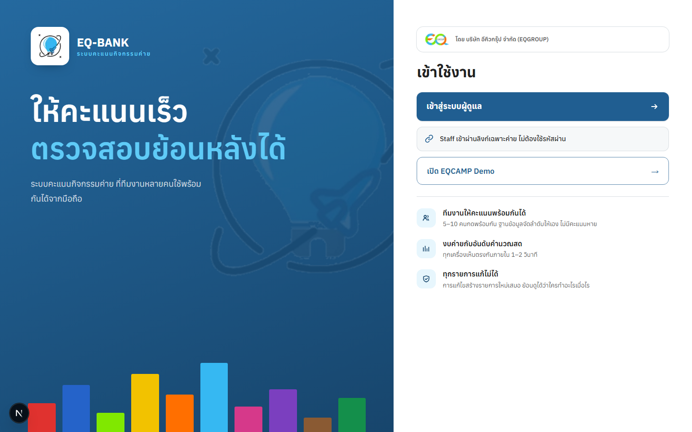

<div align="center">


# EQ-BANK · ระบบคะแนนกิจกรรมค่าย

**ให้คะแนนเร็ว ตรวจสอบย้อนหลังได้**<br>
เว็บแอปภาษาไทยแบบ Mobile-first ที่ทีมงานหลายคนกดคะแนนพร้อมกันจากมือถือได้ โดยไม่มีคะแนนหาย

[**🌐 เปิดเว็บจริง**](https://campbank-fawn.vercel.app) · [คู่มือ Deploy](docs/deployment.md) · [บันทึกการตัดสินใจ (ADR)](docs/adr/) · [Design system](docs/design-system.md)

[](https://github.com/WayuOHm99/CAMPBANK/actions/workflows/quality.yml)


</div>

<p align="center">
  
  &nbsp;
  
</p>

---

## 📌 โปรเจกต์นี้แก้ปัญหาอะไร

ค่ายกิจกรรมมักให้คะแนนกลุ่มด้วยกระดาษหรือไฟล์ Excel ที่แชร์กัน เมื่อทีมงานหลายคนให้คะแนนพร้อมกัน คะแนนจะทับกัน หาย หรือตรวจย้อนไม่ได้ว่าใครให้เท่าไร

EQ-BANK ใช้แนวคิด **"ธนาคารคะแนน"** คือ 1 หน่วยเงินกิจกรรมจำลอง = 1 คะแนน แต่ละค่ายมีงบประมาณ ทุกการให้คะแนนเป็นรายการที่บันทึกถาวร และแก้ไขด้วยการสร้างรายการใหม่เท่านั้น

> ไม่ใช่ระบบเงินจริง และไม่มีการชำระเงิน

## ✨ ความสามารถหลัก

| | |
| --- | --- |
| 👥 **ทีมงานให้คะแนนพร้อมกันได้** | 5–10 คนกดพร้อมกัน ฐานข้อมูลเรียงลำดับให้เอง ไม่มีคะแนนหาย |
| 📊 **งบและอันดับอัปเดตสด** | ทุกเครื่องเห็นตรงกันภายใน 1–2 วินาทีผ่าน Supabase Realtime |
| 🛡️ **ทุกรายการแก้ไม่ได้** | การแก้ไขและ Undo สร้างรายการใหม่ ย้อนดูได้ว่าใครทำอะไรเมื่อไร |
| 🔗 **Staff เข้าด้วยลิงก์** | ทีมงานแต่ละคนมีลิงก์ของตัวเอง ไม่ต้องจำรหัสผ่าน |
| 🏆 **หน้าอันดับแยกสำหรับโชว์** | ลิงก์ Leaderboard แยกจากลิงก์ทีมงาน เปิดขึ้นจอได้โดยไม่ต้องให้สิทธิ์ให้คะแนน |
| 🔐 **ผู้ดูแลเข้าด้วย PIN** | PIN ถูก hash ในฐานข้อมูล บังคับเปลี่ยนตอนเข้าครั้งแรก และบันทึก Audit |
| 📱 **ติดตั้งเป็นแอปได้ (PWA)** | ใช้ได้บน iPhone, Android, iPad และคอมพิวเตอร์ |

## 🏗️ จุดที่น่าสนใจเชิงวิศวกรรม

- **ฐานข้อมูลเป็นผู้ตัดสิน** คะแนน งบ สิทธิ์ และอันดับถูกคำนวณใน PostgreSQL ผ่าน atomic RPC และ Row Level Security ไม่ใช่ในเบราว์เซอร์
- **เขียนคะแนนทีละรายการต่อค่าย** (serialize per camp) พร้อม idempotency กันกดซ้ำ ดู [ADR-0005](docs/adr/0005-serialize-score-writes-per-camp.md)
- **ทดสอบการกดพร้อมกันจริง** Integration test ยิง 2, 5 และ 10 sessions พร้อมกัน รวมถึงกรณีข้ามค่าย, Undo และการปิดค่ายระหว่างกด
- **E2E บนเบราว์เซอร์จริง** Mobile Safari (WebKit) และ Desktop Chromium ครบทุก flow หลัก
- **CI ครบทุกชั้น** audit, lint, typecheck, unit, pgTAP, integration, E2E และ build
- **ทุกการตัดสินใจมีเหตุผลบันทึกไว้** มี ADR 12 ฉบับใน [`docs/adr`](docs/adr/)

## 🧰 เทคโนโลยี

| ส่วน | เลือกใช้ |
| --- | --- |
| Frontend | Next.js 16 (App Router), React 19, TypeScript, Tailwind CSS 4 |
| Backend / Database | Supabase: PostgreSQL, RLS, RPC, Realtime, Anonymous auth |
| Validation | Zod |
| Testing | Vitest, Testing Library, pgTAP, Playwright |
| Monitoring | Sentry, Vercel Speed Insights |
| Hosting | Vercel + Supabase |

---

# 👩‍💻 สำหรับนักพัฒนา
เว็บแอปภาษาไทยแบบ Mobile-first สำหรับให้คะแนนกิจกรรมค่าย โดย `1 หน่วยเงินกิจกรรมจำลอง = 1 คะแนน` ระบบใช้ PostgreSQL เป็นผู้ตัดสินคะแนน งบ สิทธิ์ ประวัติ และอันดับ ไม่ใช่ระบบเงินจริงและไม่มี Payment

## Requirements

- Node.js 24 หรือใหม่กว่า
- npm 11 หรือใหม่กว่า
- Docker Desktop (ใช้เฉพาะ Local Supabase)

## เริ่มใช้งานในเครื่อง

ติดตั้ง dependency:

```bash
npm install
```

เปิด Docker Desktop แล้วเริ่ม Local Supabase:

```bash
npm run db:start
```

คัดลอก `.env.example` เป็น `.env.local` แล้วใส่เฉพาะค่า Local `API_URL` และ `PUBLISHABLE_KEY` ที่คำสั่งด้านบนแสดง:

```env
NEXT_PUBLIC_SUPABASE_URL=http://127.0.0.1:54321
NEXT_PUBLIC_SUPABASE_ANON_KEY=<local publishable key>
SUPABASE_SERVICE_ROLE_KEY=
```

ใช้ migration และ seed ใหม่ทั้งหมดกับฐานข้อมูล Local เท่านั้น:

```bash
npm run db:reset
npm run db:types
```

คำสั่ง `db:reset` ลบข้อมูล Local จึงห้ามใช้กับฐานข้อมูลจริง ตัว Integration runner ตรวจพอร์ต Local `54321/54322` ก่อน reset อัตโนมัติ

เปิดเว็บ:

```bash
npm run dev
```

- เครื่องนี้: `http://localhost:3000`
- มือถือหรือแท็บเล็ตใน Wi-Fi เดียวกัน: ใช้ Network URL ที่ Next.js แสดง
- Demo Staff A: `http://localhost:3000/join/TEST-30000000-0000-4000-8000-000000000001` (Staff แต่ละคนมีลิงก์ของตัวเอง ดูได้ในหน้า Admin ส่วน "ลิงก์")
- Admin: `http://localhost:3000/admin`

หน้าเว็บปรับตามมือถือ, iPhone, Android, iPad, แท็บเล็ต และคอมพิวเตอร์บน browser สมัยใหม่ ถ้าเปลี่ยน Wi-Fi หรือสลับมาใช้ Hotspot ให้หยุดแล้วรัน `npm run dev` ใหม่ จากนั้นใช้ Network URL ใหม่ที่แสดง เพราะ IP ของเครื่องอาจเปลี่ยนได้

เมื่อ `.env.local` ใช้ Local Supabase ที่ `127.0.0.1` หน้าเว็บจะเปลี่ยนเฉพาะ hostname เป็น Network host ให้อัตโนมัติเมื่อเปิดจาก iPhone เช่น `192.168.x.x:54321` โดยไม่แก้ Hosted/Production URL หาก iPhone เปิดไม่ได้ ให้ตรวจว่าเครื่องและ iPhone อยู่ Wi-Fi เดียวกันและ Windows Firewall อนุญาตพอร์ต Local `3000` กับ `54321`

## Demo data

- Camp: `EQCAMP Demo`
- Budget: `100,000`
- Staff: `Staff A`, `Staff B`, `Staff C`
- Admin: `Admin Demo`
- PIN ชั่วคราวเฉพาะ Development: `1234`

ครั้งแรก Admin ต้องเปลี่ยน PIN ก่อนจัดการ Camp ห้ามนำ Demo PIN ไปใช้กับ Pilot หรือ Production

Admin คนถัดไปเพิ่มได้จากหน้า Camp ส่วน `Admin`: ระบุชื่อและ PIN ชั่วคราว 4 หลัก แล้ว Admin คนนั้นต้องตั้ง PIN ใหม่เมื่อเข้าสู่ระบบครั้งแรก การรีเซ็ต PIN อยู่ในส่วนเดียวกันและต้องระบุเหตุผล ช่อง PIN ทุกจุดซ่อนค่า รับเฉพาะตัวเลข 4 หลัก และเปิดแป้นตัวเลขบน iPhone หน้าเข้าสู่ระบบแสดงช่อง PIN แยก 4 ตำแหน่งและบอกจำนวนหลักที่กรอกแล้วโดยไม่เปิดเผยตัวเลข

## Admin คนแรก (ระบบที่ไม่ใช้ Demo seed)

ใส่ `SUPABASE_SERVICE_ROLE_KEY` ใน `.env.local` เฉพาะเครื่องที่เชื่อถือได้ แล้วรัน:

```bash
npm run admin:bootstrap
```

สคริปต์รับ PIN แบบซ่อนและเรียก RPC ที่อนุญาตเฉพาะ Service Role; PIN ถูก hash ใน PostgreSQL และไม่ถูกพิมพ์หรือบันทึกใน Audit หลังสำเร็จให้นำ Service Role Key ออกจากเครื่องที่ไม่จำเป็น ห้ามตั้งชื่อตัวแปรนี้ด้วย `NEXT_PUBLIC_`

## การทดสอบ

เปิด Docker Desktop และ Local Supabase ก่อน Integration/E2E:

```bash
npm run test:unit
npm run test:integration
npm run test:e2e
```

- Unit: Budget, warning threshold, negative guard, ranking/tie-break และ permissions
- Integration: authenticated RPC/RLS, idempotency, concurrency 2/5/10 sessions, cross-Camp, Undo, Adjustment, History, Audit และ Close race
- E2E: Mobile Safari และ Desktop Chromium สำหรับ flow หลักทั้งหมด พร้อม responsive checks ของหน้า Admin PIN และ Staff Group บน iPhone Safari, Android Chrome, iPad Safari และ Desktop Chrome

Integration และ E2E runner จะตรวจยืนยันพอร์ต Local Supabase แล้ว reset กลับไปที่ seed ก่อนเริ่มแต่ละชุด เพื่อให้การรันตามลำดับด้านล่างไม่ใช้ PIN, Admin หรือ Camp ที่ชุดก่อนหน้าแก้ไว้

Quality gate ทั้งหมด:

```bash
npm run lint
npm run typecheck
npm run test:unit
npm run test:integration
npm run test:e2e
npm run build
```

อย่ารายงานว่าคำสั่งผ่านจนกว่าจะรันและตรวจ exit code จริง

## PWA และ Offline

ก่อน release ให้ทำ [Physical-device Pilot rehearsal](docs/pilot-rehearsal.md) บน Safari อย่างน้อย 5 sessions พร้อม Android รุ่นกำลังต่ำและ iPhone/iPad โดยใช้ `bash scripts/pilot-rehearsal.sh` ช่วยบันทึกผล การทดสอบจำลองใน Playwright ยังไม่แทนผลจากเครื่องจริง

Manifest, install metadata และ Service Worker มีไว้สำหรับติดตั้งเว็บแบบพื้นฐานเท่านั้น Service Worker ไม่ cache หรือ queue Score request เมื่อ Internet ขาด ปุ่มคะแนนจะถูกปิดและระบบจะ refresh สถานะจริงก่อนเปิดปุ่มอีกครั้ง

## โครงสร้างหลัก

```text
src/app/                 Routes และ metadata
src/components/          Staff, Admin, Leaderboard, History และ shared UI
src/lib/                 Supabase, ranking, money, permissions และ Realtime
supabase/migrations/     Schema, RLS และ atomic RPC ตามลำดับเวอร์ชัน
supabase/seed.sql        Development seed
tests/unit/              Pure behavior tests
tests/integration/       Local authenticated Supabase tests
tests/e2e/               Playwright WebKit/Chromium tests
```

## หยุด Local services

```bash
npm run db:stop
```

## Production boundary

ขั้นตอนเตรียมระบบออนไลน์และ CI อยู่ใน [คู่มือ Deploy](docs/deployment.md) ข้อมูลสีที่ระบบต้องใช้ติดตั้งผ่าน migrations แล้ว โดยไม่ต้องนำ Demo seed ขึ้นระบบจริง

โปรเจกต์เตรียมไว้สำหรับ Supabase และ Vercel แต่การ Push, Merge, เชื่อม Production database หรือ Deploy Production ต้องได้รับอนุมัติแยกต่างหาก ไม่มีคำสั่งใดใน README นี้ทำ Production deployment
